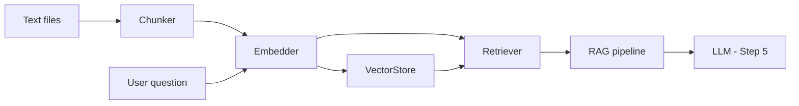

# Learning monorepo

Two independent tracks — no shared code.

| Track | Goal | Start here |
|-------|------|------------|
| **Rust — RAG** | Vector DBs & RAG CLI from scratch | [docs/STEPS.md](docs/STEPS.md) · `cargo test` |
| **C — side quest** | Systems C → simple emulator (TinyVM) | [c/README.md](c/README.md) · `make -C c test EX=01` |

---

# Vector Databases & RAG in Rust

A hands-on tutorial project. You build RAG from scratch, one module at a time.

## Current state (Step 0)

The repo ships with **chunking (stub)** and a **Rust warm-up module**:

| What | Where |
|------|-------|
| Document chunking (stub) | `src/chunk.rs` |
| Rust warm-up exercises | `src/rust_warmup.rs` — [docs/RUST_WARMUP.md](docs/RUST_WARMUP.md) |
| Ingest CLI | `src/main.rs` |
| Sample corpus | `data/sample_docs/` |
| RAG walkthrough | [docs/STEPS.md](docs/STEPS.md) |
| AI learning workflow | [docs/AI_LEARNING_WORKFLOW.md](docs/AI_LEARNING_WORKFLOW.md) |
| Weekly study routine | [docs/WEEKLY_ROUTINE.md](docs/WEEKLY_ROUTINE.md) |
| **Roadmap & progress** | [docs/ROADMAP.md](docs/ROADMAP.md) · [docs/PROGRESS.md](docs/PROGRESS.md) |
| AI tutor prompt (Cursor) | [AGENTS.md](AGENTS.md) |

`search` and `ask` don't exist yet — you'll add them when you build retrieval and RAG.

## Quick start

```bash
cargo test rust_warmup   # 9 exercises — lifetimes are 8 & 9
cargo test
cargo run -- ingest
```

## What you'll build

| Step | You create | Concept |
|------|------------|---------|
| 1 | (implement) `chunk.rs` | Sliding-window chunking |
| 2 | `embed.rs` | Vectors, cosine similarity, mock embedder |
| 3 | `store.rs` | In-memory vector search |
| 4 | `retrieve.rs` + `search` CLI | Query → context |
| 5 | `rag.rs` + `ask` CLI | Prompt + LLM generation |
| 6 | Traits + optional Qdrant/LanceDB | Swappable backends |

Read the full guide in **[docs/STEPS.md](docs/STEPS.md)**.

**Long-term plan:** [docs/ROADMAP.md](docs/ROADMAP.md) (blog series + Qdrant + peer polish) · track sessions in [docs/PROGRESS.md](docs/PROGRESS.md).

## Project layout

```
rust-rag-learn/
├── c/                    # C side quest (separate from RAG)
├── data/sample_docs/     # Corpus to ingest
├── docs/STEPS.md         # Step-by-step guide (tutor mode)
├── src/
│   ├── chunk.rs          # Step 1 — sliding-window chunking
│   ├── rust_warmup.rs    # Rust exercises (do these first if rusty)
│   ├── lib.rs
│   └── main.rs           # ingest today; search/ask later
└── (you add embed.rs, store.rs, retrieve.rs, rag.rs)
```

## Architecture (target)



## Tutor mode

This is a learning repo, not a library. **[AGENTS.md](AGENTS.md)** tells Cursor (and other AI tools) how to tutor you; **[docs/AI_LEARNING_WORKFLOW.md](docs/AI_LEARNING_WORKFLOW.md)** has session rituals, stuck-ladder prompts, and scaffold-vs-replacement guidance.

When you ask for help:

1. You'll be asked what you've tried first
2. Concepts get explained — full solutions don't get pasted upfront
3. Hints escalate only if you're stuck
4. Your code gets reviewed critically

**First assignment:** Read the sample docs, run `cargo run -- ingest`, then explain in your own words why RAG doesn't embed whole books as one vector.

## After this tutorial

- [Qdrant Rust client](https://github.com/qdrant/rust-client) for persistent ANN search
- [fastembed-rs](https://github.com/Anush008/fastembed-rs) for local ONNX embeddings
- [candle](https://github.com/huggingface/candle) for running models in pure Rust
