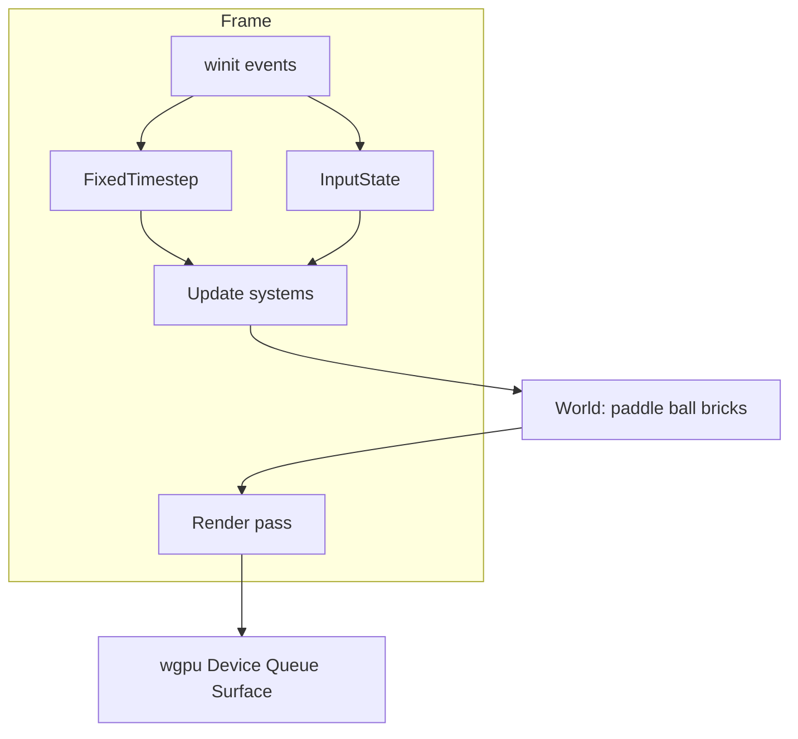

# Vision — rust-webgpu

**North star:**

> Build a **minimal 3D game engine in Rust + WebGPU from scratch** — app loop, input, fixed timestep, camera, meshes, simple collision/scenes — enough to ship **3D Breakout** on *your* code. Document *why* each subsystem exists so future-you (and peers) can learn from the decisions.

**Implementation guide:** [STEPS.md](STEPS.md) · **Pace & milestones:** [ROADMAP.md](ROADMAP.md) · **Your checklist:** [PROGRESS.md](PROGRESS.md)

---

## Capstone demo (~3 months)

When Year-1 phases are complete, you will have:

- A resize-safe window with a **perspective camera** aimed at a 3D playfield
- **Colored box meshes** for paddle, ball, and brick grid
- **Fixed timestep** update + input sampling (WASD / arrows)
- **AABB collision** and Breakout rules (bounce, clear bricks, win/lose)
- An honest **architecture writeup** — not Unity/Bevy; a learning engine you can explain

You write every module. The repo starts minimal — you add `gpu.rs`, `mesh.rs`, `time.rs`, `camera.rs`, `collision.rs`, `game.rs`, and the rest as you go.

**Optional later (Phase 8):** instancing / compute particles — a GPU deep dive *after* the playable engine ships. Not on the critical path.

---

## What “engine” means here (honest scope)

Not Unity. Not Bevy. A learning engine with:

| Subsystem | Year-1 bar |
|-----------|------------|
| Frame ownership | events → update → render → present |
| Time | fixed timestep + accumulator |
| Input | keyboard (and mouse as needed for camera) |
| Camera | perspective + MVP uniforms |
| Rendering | mesh boxes, depth buffer |
| World | simple `Vec` / structs (full ECS is a later stretch) |
| Collision | AABB for Breakout |

---

## Cognition principles (non-negotiable)

This track is for **deep understanding**, not checkbox velocity.

1. **Socratic first** — one question before one hint ([SOCRATIC_METHOD.md](../../docs/SOCRATIC_METHOD.md))
2. **Explain-back gates** — after each phase milestone, write 3–5 sentences *from memory* (no peeking) answering the phase “why” prompt
3. **Paper-before-code** — for Steps 3+, sketch the design (ASCII or paper) before implementing
4. **Decision notes** — at forks (fixed vs variable timestep; `Vec` world vs ECS), write a short choice *before* coding
5. **Protected logic** — AI may scaffold empty files; you implement game loop, camera math, collision, and Breakout rules (unless stuck ladder level 5)
6. **Bite-sized** — ≤3 substeps per session, ≤15 min each; stop mid-step with a note in [PROGRESS.md](PROGRESS.md)

---

## Why this project

| Benefit | Detail |
|---------|--------|
| **Visible progress** | Triangle → cube → moving cube → playable Breakout |
| **Engine cognition** | You own time, state, and the frame — not just shaders |
| **3D fundamentals** | Perspective, depth, MVP, AABB — transferable to bigger engines |
| **Feasible pace** | 2–4 sessions/week, 30–60 min, ~3 months to playable Breakout |
| **Shareable** | Blog posts at each phase — problem-first, not tutorial dump |

---

## What “done” looks like (Year 1)

| Deliverable | Success criteria |
|-------------|------------------|
| **Working engine + game** | Playable 3D Breakout on your loop, camera, meshes, collision |
| **Blog series** | One post per major phase — problem-first |
| **Polished repo** | README story + architecture diagram; verify commands work |
| **Peer value** | Another engineer learns *why* each subsystem exists |

---

## Target architecture

**Modules you create over time:**

| Module | Phase | Role |
|--------|-------|------|
| `webgpu_warmup.rs` | 0 | Math + layout + AABB |
| `window.rs` / `gpu.rs` | 1 | Window, device, surface |
| `shader.wgsl` / `pipeline.rs` | 2 | First 3D-capable pipeline |
| `mesh.rs` | 3 | Box mesh, vertex/index buffers |
| `app.rs` / `time.rs` / `input.rs` | 4 | Loop, fixed timestep, keys |
| `camera.rs` | 5 | Perspective + playfield view |
| `world.rs` / `collision.rs` | 6 | Entities + AABB |
| `game.rs` or `breakout.rs` | 7 | Rules, win/lose |
| `particles.rs` | 8 (optional) | Post-game GPU deep dive |

---

## Learning path

1. **Phase 0** — [WEBGPU_WARMUP.md](WEBGPU_WARMUP.md): math + buffer layout + AABB (no GPU window)
2. **Steps 0–7** — [STEPS.md](STEPS.md): window → triangle → cube → depth/camera → loop/input → Breakout
3. **Track progress** — [PROGRESS.md](PROGRESS.md): update after every session

---

## Start here

If you haven't begun yet:

1. Read [STEPS.md](STEPS.md) Step 0
2. Run `cargo run -p rust-webgpu`
3. Answer: *Why does WebGPU have separate `Device`, `Queue`, and `Surface`?*

Then begin Phase 0 warm-up before adding `wgpu` dependencies.
