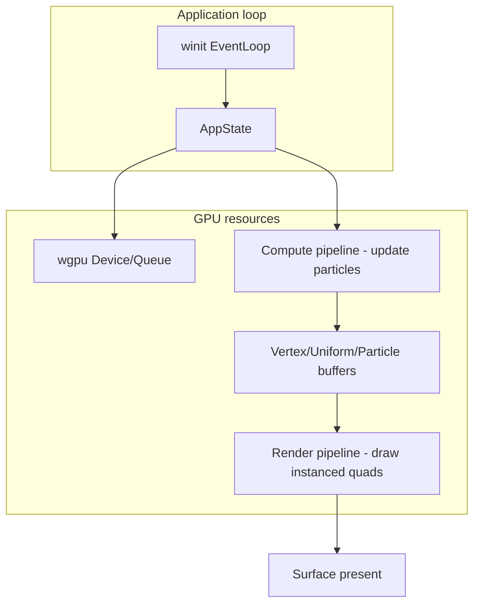

# Vision — rust-webgpu

**North star:**

> Build a from-scratch Rust WebGPU playground — an interactive window where you orbit a live particle field updated on the GPU by compute shaders. Document each phase so another Rust learner can follow the same path.

**Implementation guide:** [STEPS.md](STEPS.md) · **Pace & milestones:** [ROADMAP.md](ROADMAP.md) · **Your checklist:** [PROGRESS.md](PROGRESS.md)

---

## Capstone demo

When the track is complete, you will have:

- A resize-safe window with an **orbit camera** (mouse drag + scroll)
- **Thousands of instanced particles** rendered as billboards/quads
- A **compute pipeline** that updates particle velocity and position each frame
- **Mouse interaction** that disturbs or seeds the field
- Two WGSL entry points in one shader module: **compute** (simulate) + **render** (draw)

You write every module. The repo starts minimal — you add `gpu.rs`, `shader.wgsl`, `particles.rs`, and the rest as you go.

---

## Why this project

| Benefit | Detail |
|---------|--------|
| **Visible progress** | Every step puts pixels on screen — triangle, cube, particle cloud |
| **Full WebGPU arc** | Instance → surface → device → WGSL → buffers → render pipeline → uniforms → instancing → compute → present |
| **Feasible pace** | 2–4 sessions/week, 30–60 min, ~3–5 months (same rhythm as `rust-rag-learn/`) |
| **Shareable** | Blog posts at each phase; no asset pipeline or game engine required |

---

## What “done” looks like

| Deliverable | Success criteria |
|-------------|------------------|
| **Working app** | Resize-safe window; render + compute pipelines; orbit camera; mouse disturbs particles |
| **Blog series** | One post per major phase — problem-first, not tutorial dump |
| **Polished repo** | README story + pipeline diagram; verify commands work |
| **Peer value** | Another engineer learns *why* each WebGPU object exists, not just copies boilerplate |

---

## Target architecture

**Modules you create over time:**

| Module | Step | Role |
|--------|------|------|
| `main.rs` | 0 | Event loop entry |
| `window.rs` | 1 | `winit` window + resize events |
| `gpu.rs` | 1 | Instance, adapter, device, queue, surface config |
| `shader.wgsl` | 2 | Shared WGSL (expand each step) |
| `pipeline.rs` | 2 | Render pipeline builder |
| `mesh.rs` | 3 | Vertex layout, index buffers |
| `camera.rs` | 4 | Orbit math + uniform buffer |
| `particles.rs` | 5–6 | Particle state, instancing, compute dispatch |
| `webgpu_warmup.rs` | Phase 0 | Pure-Rust exercises (no window) |

---

## Learning path

1. **Phase 0** — [WEBGPU_WARMUP.md](WEBGPU_WARMUP.md): math + buffer layout exercises (no GPU)
2. **Steps 0–7** — [STEPS.md](STEPS.md): window → triangle → cube → camera → particles → compute → polish
3. **Track progress** — [PROGRESS.md](PROGRESS.md): update after every session

---

## Start here

If you haven't begun yet:

1. Read [STEPS.md](STEPS.md) Step 0
2. Run `cargo run -p rust-webgpu`
3. Answer: *Why does WebGPU have separate `Device`, `Queue`, and `Surface`?*

Then begin Phase 0 warm-up before adding `wgpu` dependencies.
